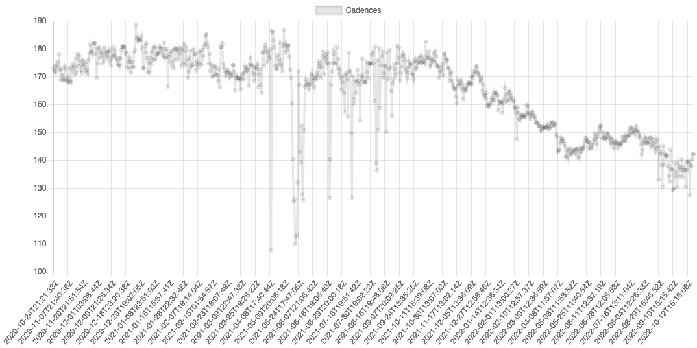
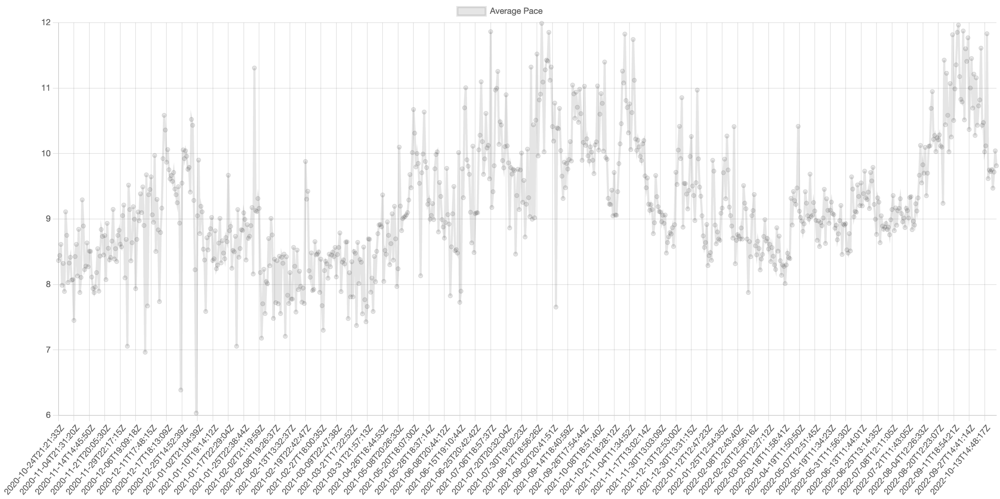

# Strava Display

**API link**: https://developers.strava.com/docs/reference/

**Cadence over time**


**Average pace over time**


**Setup:**
1. `git clone git@github.com:jeeohly/strava_display.git`
2. `npm install`
3. create .env file in root with contents:
```
STRAVA_CLIENT_ID=from here: https://www.strava.com/settings/api
STRAVA_SECRET=from here: https://www.strava.com/settings/api
```
5. open following url with your YOUR_CLIENT_ID and then click authorize:
https://www.strava.com/oauth/authorize?client_id=YOUR_CLIENT_ID&redirect_uri=http://localhost&response_type=code&scope=activity:read_all
6. get YOUR_CODE from new url and assign it to CODE variable in .env file:
http://localhost/?state=&code=YOUR_CODEscope=read,activity:read_all
Add line to .env file
```
CODE=YOUR_CODE
```
7. Get refresh token from console:
`node strava.js getRefreshToken`
Add line to .env file: 
```
STRAVA_REFRESH_TOKEN=YOUR_REFRESH_TOKEN
```

**Commands:**
- Get your stats:<br>
`node strava.js getStats`li
- Get all activities:<br>
`node strava.js getRuns`


